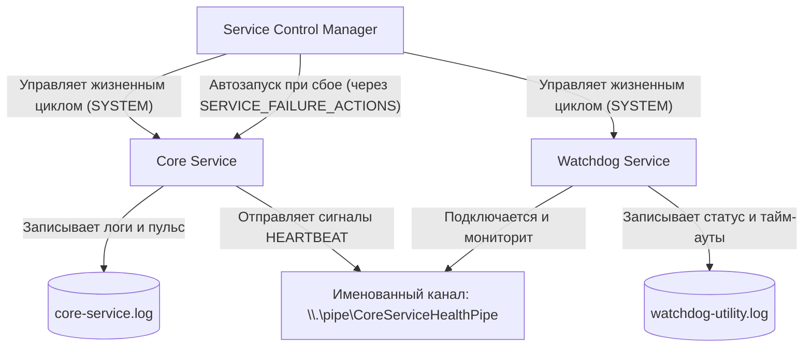

# Система Core Service + Watchdog (oko)

Отказоустойчивая архитектура фоновой службы для Windows, написанная на Rust. Система использует стандартные механизмы Windows Service Control Manager (SCM) для автоматического восстановления службы и асинхронные именованные каналы (Named Pipes) на базе Tokio с защищенным дескриптором безопасности (DACL) для легковесного мониторинга работоспособности.

## Обзор Архитектуры



1. **`core-service` (Основная служба)**: Нативная служба Windows (`CoreService`), работающая в контексте безопасности `SYSTEM`. Она реализует стандартный цикл управления службой (`ServiceMain`, обработчики контроля) с использованием низкоуровневых вызовов Windows API (`windows-sys`). Внутри запускается многопоточная среда выполнения Tokio для обработки связи по именованному каналу и фонового логирования.
2. **`watchdog-utility` (Служба-наблюдатель)**: Нативная служба Windows (`WatchdogService`), запущенная в контексте `SYSTEM`. Она считывает периодический сигнал пульса из именованного канала. Если сигнал отсутствует в течение 2 секунд (тайм-аут) или соединение внезапно разрывается, утилита логирует это событие.
3. **Восстановление через Windows SCM**: SCM осуществляет автоматическое воскрешение службы с помощью стандартных механизмов ОС. Мы настраиваем параметры `SERVICE_FAILURE_ACTIONS` программно при установке, чтобы служба автоматически перезапускалась при первом, втором и последующих сбоях.

---

## Структура каталогов

```
oko/
├── Cargo.toml               # Манифест воркспейса
├── README.md                # Документация системы на русском языке
├── core-service/
│   ├── Cargo.toml           # Зависимости Core Service (tokio, windows-sys, chrono)
│   └── src/
│       └── main.rs          # Точка входа службы, коллбеки SCM, сервер Named Pipe
└── watchdog-utility/
    ├── Cargo.toml           # Зависимости Watchdog (tokio, windows-sys, chrono)
    └── src/
        └── main.rs          # Точка входа службы, коллбеки SCM, клиент Named Pipe
```

---

## Технические детали

### 1. Безопасность Именованного Канала (Named Pipe DACL)
Для исключения уязвимостей перехвата канала ("pipe squatting") и несанкционированного подключения, именованный канал создается с явным дескриптором безопасности (DACL) на основе SDDL:
`O:SYG:SYD:(A;;GA;;;SY)(A;;GA;;;BA)`
- **Владелец и группа**: `SYSTEM` (`SY`).
- **Разрешения**: Полный доступ (Generic All, `GA`) разрешен только для учетной записи локальной системы (`SYSTEM` / `SY`) и встроенной группы Администраторов (`BA`).
- Любые подключения от имени стандартных непривилегированных пользователей блокируются на уровне ядра Windows.

Конфигурация создается с помощью вызова:
```rust
ConvertStringSecurityDescriptorToSecurityDescriptorW(...)
```
И передается при создании канала:
```rust
server_options.create_with_security_attributes_raw(pipe_name, attributes)
```

### 2. Права доступа к логам и запуск от SYSTEM
Поскольку обе службы (`CoreService` и `WatchdogService`) регистрируются и работают в контексте безопасности учетной записи `SYSTEM`:
- Исключаются проблемы разграничения прав доступа к общей директории логов `C:\ProgramData\MonitoringControl\`.
- Служба-наблюдатель обладает необходимыми привилегиями для подключения к защищенному Named Pipe.

---

## Настройка восстановления SCM (Стандартное автовосстановление ОС)

Чтобы гарантировать перезапуск основной службы при сбое, мы используем встроенные возможности Windows Service Control Manager вместо написания циклов перезапуска процессов в коде.

### А. Программная конфигурация (Rust)
При установке службы через `core-service.exe --install` вызывается функция `ChangeServiceConfig2W` с флагом `SERVICE_CONFIG_FAILURE_ACTIONS` для регистрации действий при сбое:
- **Первый сбой**: Перезапуск службы через **5 секунд**.
- **Второй сбой**: Перезапуск службы через **10 секунд**.
- **Последующие сбои**: Перезапуск службы через **20 секунд**.
- **Период сброса счетчика сбоев**: Счетчик сбросится обратно в 0, если служба успешно проработает без сбоев в течение **24 часов** (86 400 секунд).

### Б. Ручная настройка через CLI (`sc.exe`)
Если вы хотите настроить или проверить эти параметры из командной строки (запущенной от имени Администратора):

```powershell
# Настройка действий при сбое:
sc.exe failure CoreService reset= 86400 actions= restart/5000/restart/10000/restart/20000
```
> [!IMPORTANT]
> Обратите внимание на обязательные пробелы после знаков равенства (`reset= ` и `actions= `). Это требование синтаксиса утилиты `sc.exe`.

---

## Сборка и Установка

### 1. Компиляция воркспейса
Скомпилируйте оба бинарных файла в режиме release:
```powershell
cargo build --release
```

После этого будут созданы:
- `target\release\core-service.exe`
- `target\release\watchdog-utility.exe`

### 2. Команды установки служб
Запустите командную строку/PowerShell от имени **Администратора** и выполните следующие команды:

#### Установка и запуск CoreService
```powershell
# Установка службы и конфигурация автовосстановления SCM
.\target\release\core-service.exe --install

# Запуск службы через SCM
Start-Service CoreService
```

#### Установка и запуск WatchdogService
```powershell
# Установка службы-наблюдателя
.\target\release\watchdog-utility.exe --install

# Запуск службы-наблюдателя через SCM
Start-Service WatchdogService
```

#### Удаление служб
```powershell
# Удаление основной службы
.\target\release\core-service.exe --uninstall

# Удаление наблюдателя
.\target\release\watchdog-utility.exe --uninstall
```

---

## Мониторинг логов

Логи пишутся в реальном времени в каталог `C:\ProgramData\MonitoringControl\`:

```powershell
# Просмотр логов основной службы
Get-Content C:\ProgramData\MonitoringControl\core-service.log -Wait -Tail 10

# Просмотр логов наблюдателя
Get-Content C:\ProgramData\MonitoringControl\watchdog-utility.log -Wait -Tail 10
```
